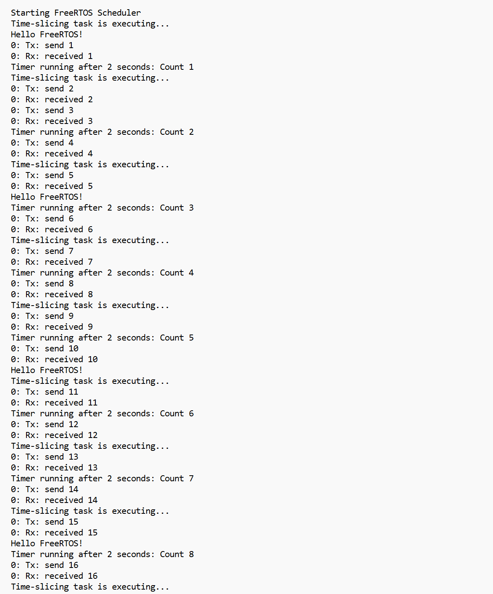

# **Port_FreeRTOS_RV_PCORE**

## **Objective**

The Port_FreeRTOS_RV_PCORE project is designed to set up and run the FreeRTOS operating system on RISC-V cores, specifically demonstrated on the UET RV PCORE platform. The project showcases the capability of FreeRTOS in managing real-time tasks on RISC-V architecture, highlighting the efficiency of the system through a simple UART communication example.

---

## **Prerequisites**

To build and run the project, ensure that you have the following tools and software installed:

- **GNU RISC-V Toolchain** (tested on Crosstool-NG)
- **Verilator**: A tool for compiling Verilog code into C++ models, used for simulation.
  - To install Verilator, follow the instructions from [Verilator Installation Guide](https://verilator.org/).
  
- **GTKWave**: A waveform viewer used to visualize simulation outputs, such as VCD files.
  - Install GTKWave with the following command (for Ubuntu-based systems):
    
    ```bash
    sudo apt-get install gtkwave
    ```
---

## **How to Build Toolchain**

Follow the steps below to build the **GNU RISC-V Toolchain** using Crosstool-NG:

1. **Clone the Crosstool-NG repository**:
   ```bash
   git clone https://github.com/crosstool-ng/crosstool-ng
   cd crosstool-ng
   ```

2. **Bootstrap and configure Crosstool-NG**:
   ```bash
   ./bootstrap
   ./configure --enable-local
   make
   ```

3. **Generate Toolchain Configuration**:
   Create a `defconfig` file (exactly the same name, with no file extension) with the following content based on your build architecture:

   **For RV32 builds**:
   ```text
   CT_EXPERIMENTAL=y
   CT_ARCH_RISCV=y
   CT_ARCH_64=n
   CT_ARCH_ARCH="rv32ima"
   CT_ARCH_ABI="ilp32"
   CT_TARGET_CFLAGS="-mcmodel=medany"
   CT_TARGET_LDFLAGS="-mcmodel=medany"
   CT_MULTILIB=y
   CT_DEBUG_GDB=y
   ```

   **For RV64 builds**:
   ```text
   CT_EXPERIMENTAL=y
   CT_ARCH_RISCV=y
   CT_ARCH_64=y
   CT_ARCH_ARCH="rv64ima"
   CT_ARCH_ABI="lp64"
   CT_TARGET_CFLAGS="-mcmodel=medany"
   CT_TARGET_LDFLAGS="-mcmodel=medany"
   CT_MULTILIB=y
   CT_DEBUG_GDB=y
   ```

4. **Run the command to save configurations**:
   ```bash
   ./ct-ng defconfig
   ```

5. **Build the GNU Toolchain**:
   ```bash
   ./ct-ng build
   ```

   This will install the toolchain to `~/x-tools/riscv32-unknown-elf` or `~/x-tools/riscv64-unknown-elf` depending on your build.

---

## **Building the Project**

1. **Add the path to your RISC-V toolchain**:
   ```bash
   export PATH=~/x-tools/{YOUR_TOOLCHAIN}/bin:$PATH
   ```

2. **Build the project using `make`**:
   Simply run:
   ```bash
   cd Demo/
   make
   ```
   
   The resulting executable file will be located at `./build/RTOSDemo.axf`.
   
3. **Converting `.axf` to `.hex`**:

    After building the project, you can convert the `.axf` binary file to a `.hex` file for further use:
   
      ```bash
      riscv32-unknown-elf-objcopy -O binary RTOSDemo.axf RTOSDemo.bin
      hexdump -ve '1/4 "%08x\n"' RTOSDemo.bin > RTOSDemo.hex
      ```
   ---

## **Running FreeRTOS Demo on UETRV_PCore**

Once the hex file is generated, follow these steps to run the project on UETRV_PCore:

Simply go to `UETRV-PCore` directory and run:
```bash
make run-freerots
```

---

## **Running the Simulation**

To simulate the project, you need to run the simulation tools:

1. **Run the simulation with UART**:
   ```bash
   cd UETRV-Pcore
   make sim-verilate-uart
   ```
    
2. **Enable VCD generation**:
   To generate a VCD file for waveform analysis, use the following command:
   ```bash
   make sim-verilate-uart vcd=1
   ```
   The output will be generated as `trace.vcd` file in main folder.
   
4. **Cycle Count Configuration**:
   If you wish to modify the number of cycles during simulation, edit the `Makefile` or pass the desired value with the `max_cycles` flag:
   ```bash
   make max_cycles=<desired_number_of_cycles>
   ```

---

## **Viewing the Output**

After running the simulation, the output will be available in the `uart_logdata.log` file in the same folder. You can check the content of this log file to see the required UART output.

For a successful demo, you should expect output similar to the following in the `uart_logdata.log   `:

<p align="center">
  
</p>
---

## **Currently Running Tasks**

The **Port_FreeRTOS_RV_PCORE** project includes the following tasks, each demonstrating different FreeRTOS functionalities:

| **Task Name**           | **Functionality**                                          | **Priority**                           | **Frequency**               |
|-------------------------|------------------------------------------------------------|----------------------------------------|-----------------------------|
| `prvQueueSendTask`      | Sends incrementing values to the queue                     | `mainQUEUE_SEND_TASK_PRIORITY` (2)     | Every **1 second**          |
| `prvQueueReceiveTask`   | Receives and logs values from the queue                    | `mainQUEUE_RECEIVE_TASK_PRIORITY` (3)  | Continuously upon send      |
| `prvPrintHelloTask`     | Prints "Hello FreeRTOS!" message                           | `mainPRINT_HELLO_TASK_PRIORITY` (1)    | Every **5 seconds**         |
| `prvTimerTask`          | Acts as a timer, increments a counter, and logs it          | `mainTIMER_TASK_PRIORITY` (4)          | Every **2 seconds**         |
| `prvTimeSlicingTask`    | Demonstrates time slicing by yielding and logging           | `mainTIME_SLICING_TASK_PRIORITY` (4)   | Every **2 seconds**         |

---

## **Adding More Tasks in FreeRTOS**

Expanding your FreeRTOS application by adding additional tasks is straightforward. Follow the steps below to integrate new tasks into your project effectively.

### **Step 1: Define Task Priority and Frequency**

Define macros to set the task's priority and execution frequency. This promotes consistency and ease of configuration across your application.

```c
#define mainNAME_TASK_PRIORITY       ( tskIDLE_PRIORITY + 2 )
#define mainNAME_TASK_FREQUENCY_MS   pdMS_TO_TICKS( 3000 ) // 3 seconds
```

### **Step 2: Define the Task Function**

Each task requires a function that implements its behavior. The function must adhere to the FreeRTOS task function prototype:

```c
static void prvNewTask( void * pvParameters )
{
    ( void ) pvParameters; // To avoid compiler warnings if not used

    for( ; ; ) // Infinite Loop (Task Never E
    {
        // Task-specific operations go here

        // Typically includes delays to manage execution frequency
    }
}
```
### **Step 3: Create the New Task**

Use the `xTaskCreate` function to add the new task to the FreeRTOS scheduler. This function requires several parameters, including the task function, name, stack size, parameters, priority, and task handle.

```c
xTaskCreate( prvNewTask, "New-Task", configMINIMAL_STACK_SIZE * 2U, NULL,
             mainNAME_TASK_PRIORITY, NULL );
```
You should add this line in the `main_blinky` function to successfully create the new task.

## **Notes for Modifications**

- To change the behavior of the tasks (such as altering the FreeRTOS tasks or their interactions), modify the `main_blinky.c` file.
- After making changes, rebuild the project using the `make` command to regenerate the `.axf` file.


