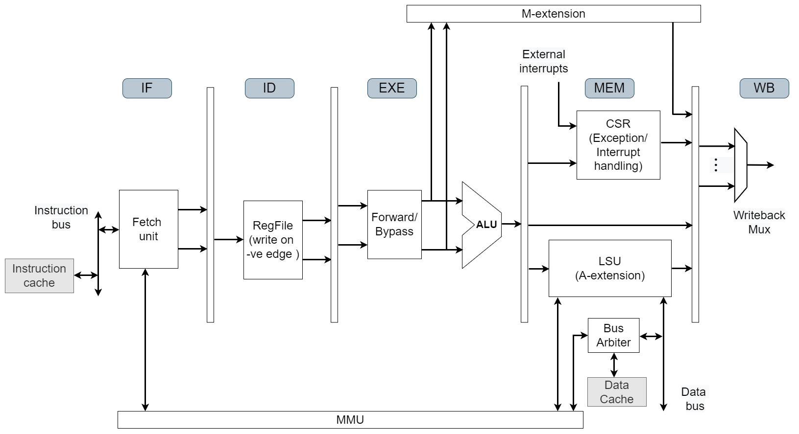
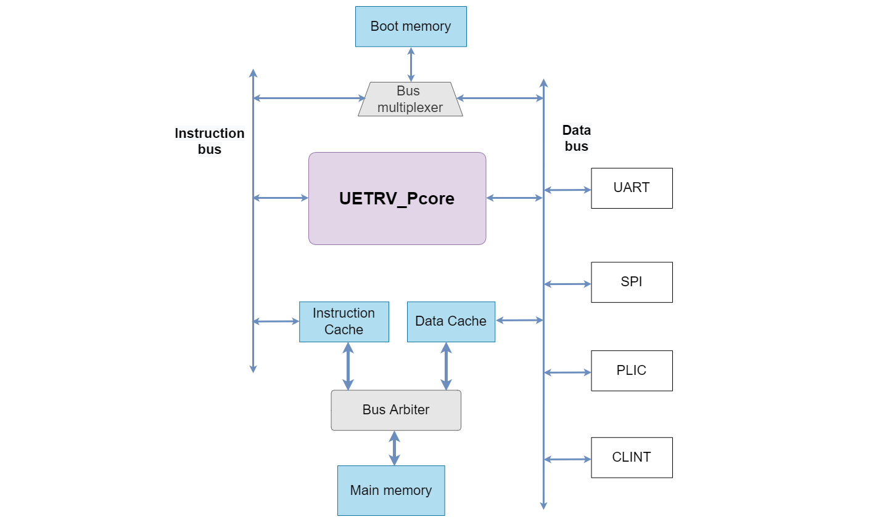

# UETRV_Pcore
[](https://github.com/ee-uet/UETRV-PCore/actions/workflows/main.yml)
[](https://uetrv-pcore-doc.readthedocs.io/en/main/index.html)

UETRV_Pcore is a RISC-V based application class SoC integrating a 5-stage pipelined processor with memory and peripherals. Currently, the core implements RV32IMACZicsr ISA based on User-level ISA Version 2.0 and Privileged Architecture Version 1.11 supporting M/S/U modes. Following are the key features of the SoC:

## Key Features
- 32-bit RISC-V ISA core that supports base integer (I) and multiplication and division (M), atomic (A), compressed (C) and Zicsr (Z) extensions (RV32IMACZicsr).
- Supports user, supervisor and machine mode privilege levels.
- Support for instruction / data (writeback) caches.
- Sv32 based MMU support and is capable of running Linux.
- 32 KB 4-way set associative instruction cache.
- 32-KB direct mapped write-back data cache. 
- Cache size, TLB entries etc., are configurable.
- Intergated PLIC, CLINT, uart, spi peripherals. 
- Uses RISOF framework to run architecture compatibility tests.
- Coremark: **2.0 Coremark/MHz** with DDR2 based main memory.
- LUTs for core (including MMU) < 4.5k and for the SoC (including cache controllers but excluding DDR controller) < 6k.

### System Design Overview
The UETRV_Pcore is an applicaion class processor capable of running Linux. A simplified 5-stage pipelined block diagram is shown below. The M-extension is implemented as a coprocessor while memory-management-unit (MMU) module is shared by instruction and data memory (alternatively called load-store-unit (LSU)) interfaces of the pipeline. Specifically, the page-table-walker (PTW) of the MMU is shared and there are separate TLBs (translation look aside buffers) for instruction and data memory interfaces. The A-extension is implemented as part of the LSU module.



The SoC block diagram shows the connectivity of the core with memory sub-system as well as different peripherals using data bus. The boot memory is connected to both instruction and data buses of the core using a bus multiplexer. The instruction and data caches share the main memory using a bus arbiter. Different necessary peripherals are connected using the data bus. Further details related to the SoC design are available at <https://uetrv-pcore-doc.readthedocs.io/en/main/>.



### SoC Memory Map
The memory map for the SOC is provided in the following table.
| Base Address        |    Description            |   Attributes    |
|:-------------------:|:-------------------------:|:---------------:|
| 0x8000_0000         |      Memory               |      R-X-W      |
| 0x9000_0000         |      UART                 |      R-W        |
| 0x9400_0000         |      PLIC                 |      R-W        |
| 0x9C00_0000         |      SPI                  |      R-W        |
| 0x0200_0000         |      CLINT                |      R-W        |
| 0x0000_1000         |      Boot Memory          |      R-X        |

- `R: Read access`
- `W: Write access`
- `X: Execute access`


## Getting Started

Install RISC-V [toolchain](https://github.com/riscv-collab/riscv-gnu-toolchain) and [verilator](https://verilator.org/guide/latest/install.html). These tools can be built by following the instructions in the corresponding links, or can be installed directly by running the following command

    sudo apt-get install -y gcc-riscv64-unknown-elf verilator gtkwave

Check that these tools are installed correctly, by running `verilator --version` and `riscv64-unknown-elf-gcc -v`.

### Build Model and Run Simulation

Verilator model of Pcore can be built using Makefile:

    make verilate

The verilator model is build under `ver_work/Vpcore_sim`. The executeable can accept the following three parameters:

- `imem`: This paramerter accepts the file that contain the hexadecimal instructions of compiled program.
- `max_cycles`: This parameter cotrols the maxiumum number of cycles for simulation. Simulation terminates after executing these many cycles.
- `vcd`: This parameters accepts a boolean value. If it is 0, the waveform file `trace.vcd` will not be dumped and vice versa.

An example program to print `HELLO` on terminal via UART is compiled and its hex instructions are availabe in [here](/sdk/example-uart/hello.hex). Run the following command to simulate the example program

    make sim-verilate-uart 

This will simulate `hello.hex` and dump UART logs in `uart_logdata.log` file. If `vcd=1` is added to the above command, `trace.vcd` will be created that can be viewed by running

    gtkwave trace.vcd

The `imem` and `max_cycles` may be overwritten in Makefile using.

    make sim-verilate-uart imem=</path/to/hex/file> max_cycles=<No. of cycles> 

### Verification

UETRV_Pcore uses RISOF framework to run Architecture Compatibility Tests (ACTs). Instructions to run these tests can be followed in [verif](/verif/) directory.

## Booting Linux

Using the same procedure as outlined above, we can simulate the Linux bootup using a prebuilt image (`imem.zip`) available in `./sdk/example-linux/` folder. The pre-built Linux image is prepared using `initramfs` based root file system (`rootfs`) and is directly linked into the kernel. Furthermore, the Linux/kernel image is linked as a `payload` to the `OpenSBI` that acts as a first-level bootloader. The `imem.zip` image contains:

- Root file system (`rootfs.cpio`) based on `initramfs` using Busybox 1.33
- The Linux (version 6.1.0) with rootfs.cpio linked into the kernel
- OpenSBI (ver. 0.9) based first order bootloader with Linux kernel as payload

During booting process, the processor starts executing zero-level bootloader from `bmem` and then jumps to first-level bootloader (OpenSBI), which after necessary initializations, hands the control over to the kernel.

### Booting with Verilator
For Verilator based simulation one configurtion is required. Open the file `rtl/defines/pcore_config_defs.svh` and uncomment the line \` `define RTL_SIMULATION 1`. Now run the following command to extract the `imem.txt` to `./sdk/example-linux/` and simulate the Linux booting process using this pre-built image. 

    make sim-verilate-linux

The output is logged to the `uart_logdata.log` file (a copy of this log is available in `./sdk/`). 

### Booting on FPGA Board 
The processor is tested using Nexys-A7 (100T) FPGA board and Vivado 2019. Type in the following command to open the project in Vivado 2019
```
vivado PCore_FPGA/PCore_FPGA.xpr
```
Make sure that \` `define RTL_SIMULATION 1` is commented out, while \` `define DRAM 1` is uncommented in the file `rtl/defines/pcore_config_defs.svh`. The instruction and data cache sizes can also be configured here. 

### Generate bitstream
New bitstream can be generated with the exisitng project or you may use the prebuilt bitstream available in the folder ``FPGA_Target/Bit_stream``

### Booting Linux Image
* Load the bitstream on the FPGA, your serial monitor will show message `Load File`
* Type in the following commands to load the prebuilt Linux image
  ```
  cd sdk/load_image
  python3 serial_sendfile.py <baud_rate in MHz> <path/to/image/file>
  ```
* Baud rate of existing bitstream is ``4000000``. Sample Linux image is saved in ``sdk/load_image`` folder.
* If using default baud rate and default bitstream, the following command can be run
  ```
  python3 serial_sendfile.py 4 imem.bin
  ```
After successful downloading of the image the booting process starts. A snapshot of the boot log is shown below. 


